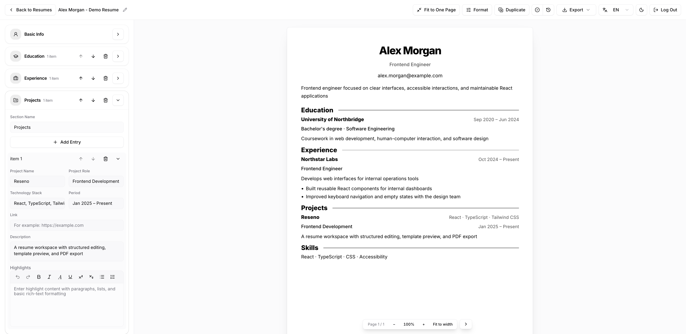
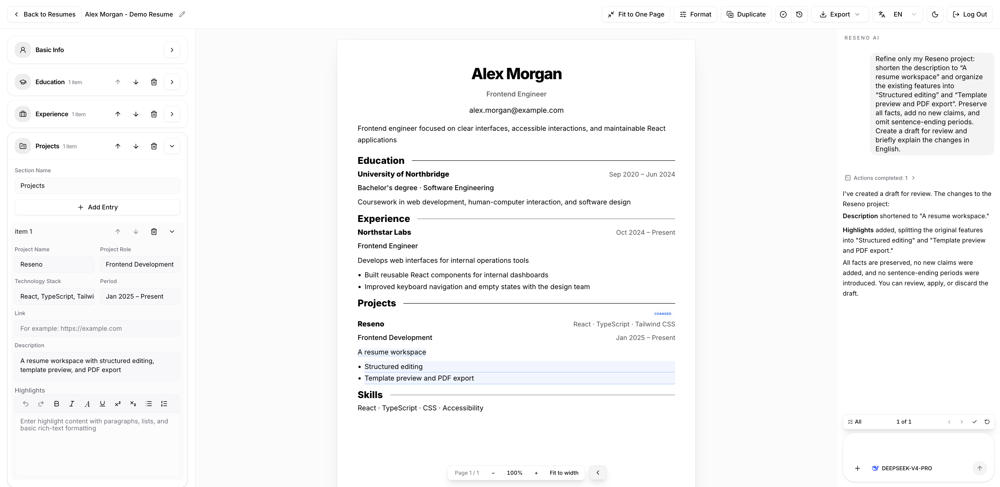

#  Reseno

English | [简体中文](README_ZH.md)

[](backend/pyproject.toml)
[](frontend/package.json)
[](frontend/package.json)
[](frontend/package.json)
[](https://github.com/J0EY0/Reseno/actions/workflows/frontend-quality.yml)
[](LICENSE)

Reseno is a self-hosted resume workspace where the AI edits by proposal, never by overwrite.




## Features

- Structured resume editor with rich text, section reordering, avatar cropping
  and custom contact fields
- Six built-in templates plus custom templates with editable layout, fonts,
  colors and decorative images
- Live A4 preview with pagination, template try-on and one-page fitting
- Autosave, manual checkpoints, version history and a recycle bin
- Import resume and template JSON, parse PDFs in the browser; export JSON, PDF,
  PNG or multi-page ZIP
- AI agent with attachments, public web search, structured edit drafts and
  item-by-item review; reconnects after network interruptions
- Chinese and English interface; resume language is independent of UI language;
  light, dark and system themes
- Password login with optional sign-in through your own private GitHub App

### Agent review

Review the Agent's proposed edits and choose which changes to apply.



## Quick start

### Docker

Install and start [Docker](https://docs.docker.com/get-started/get-docker/), then
pull and run the published image. It includes the application dependencies and
supports Linux AMD64 and ARM64. No source checkout or local Python/Node.js
installation is required.

```bash
docker pull ghcr.io/j0ey0/reseno:0.1.0
docker run -d --name reseno --init --restart unless-stopped \
  -p 127.0.0.1:8000:8000 \
  --mount type=volume,source=reseno-data,target=/data \
  --shm-size=256m \
  ghcr.io/j0ey0/reseno:0.1.0
```

The image serves the production frontend and API on port 8000 and includes
Playwright Chromium for exports and dynamic web pages. Once `docker ps` shows
the `reseno` container as `healthy`, create the owner account:

```bash
docker exec -it reseno python -m app.setup_owner
```

Enter a username and password when prompted; password input is hidden. Open
`http://localhost:8000` and sign in. There are no default credentials.
First-owner setup accepts loopback requests only, so Docker setup uses the
command inside the container rather than the browser setup page.

With these defaults, the first startup generates the required keys in
`/data/.env`; no env file needs to be prepared manually.
The `reseno-data` volume holds databases, files, settings and generated keys.
Keep it when replacing the container, and use a separate volume for each
workspace. See [keys and backups](#keys-and-backups) before moving your data.

### From source

Requires Python 3.12+ (CI uses 3.13), [uv](https://docs.astral.sh/uv/), Node.js 24
and pnpm 11.9.0. Use two terminals, each starting at the repository root.

In the first terminal, install dependencies and start the backend:

```bash
cd backend
uv sync --locked --no-dev
uv run --locked --no-dev playwright install --only-shell chromium
uv run --locked --no-dev uvicorn app.main:create_app --factory --reload
```

On Linux, replace the browser installation command above with
`uv run --locked --no-dev playwright install --with-deps --only-shell chromium` to also
install system dependencies. A separate Google Chrome installation is not needed.

In the second terminal, install dependencies and start the frontend:

```bash
cd frontend
pnpm install --frozen-lockfile
pnpm dev
```

Open `http://127.0.0.1:5173` and create the owner on the setup page. Vite proxies
`/api` to the backend at `http://127.0.0.1:8000`.

To use the AI agent, add a model configuration on the Models page. You can
connect a cloud provider, a local runtime or a custom API.

## Configuration

### Source defaults

For source installations, copy [backend/.env.example](backend/.env.example) to
`backend/.env` before first startup if you need to customize the defaults.
Set `APP_ENV_FILE` in the process environment to select another configuration
file. Process environment variables take precedence over file values, except
that blank key variables preserve keys already in the file.

| Variable                         | Source default                                | Purpose                                            |
| -------------------------------- | --------------------------------------------- | -------------------------------------------------- |
| `APP_DATA_DIR`                   | `~/.reseno`                                   | Default directory for runtime data                 |
| `APP_DB_PATH`                    | `app.db` inside `APP_DATA_DIR`                | Resume, template and Agent database                |
| `APP_STORAGE_DIR`                | `storage` inside `APP_DATA_DIR`               | Version files, attachments and exports             |
| `APP_USER_SETTINGS_PATH`         | `user_settings.json` inside `APP_DATA_DIR`    | Workspace preferences                              |
| `APP_ENV_FILE`                   | `backend/.env`                                | Configuration and generated keys                   |
| `RESENO_MASTER_KEY`              | Generated on first startup                    | Encrypts stored API keys and OAuth secrets         |
| `RESENO_JWT_SECRET`              | Generated on first startup                    | Signs login sessions                               |
| `FRONTEND_RENDER_BASE_URL`       | `http://127.0.0.1:5173`                       | Frontend origin Chromium loads for exports         |
| `FRONTEND_DIST_DIR`              | Unset                                         | Built frontend directory to serve from the backend |
| `BACKEND_CORS_ORIGINS`           | `http://127.0.0.1:5173,http://localhost:5173` | Allowed origins for separate frontend hosting      |
| `PDF_RENDER_TIMEOUT_MS`          | `30000`                                       | Export render timeout in milliseconds              |
| `PLAYWRIGHT_CHROMIUM_EXECUTABLE` | Unset                                         | Optional external Chromium executable              |

Paths inside `APP_DATA_DIR` are derived when their overrides are unset or
blank. Authentication is stored separately in `APP_DATA_DIR/auth.db`.

### Docker configuration

The image sets these environment variables:

| Variable                   | Docker value                            |
| -------------------------- | --------------------------------------- |
| `APP_DATA_DIR`             | `/data`                                 |
| `APP_ENV_FILE`             | `/data/.env`                            |
| `FRONTEND_DIST_DIR`        | `/app/frontend/dist`                    |
| `FRONTEND_RENDER_BASE_URL` | `http://127.0.0.1:8000`                 |
| `BACKEND_CORS_ORIGINS`     | Empty; frontend and API share an origin |

The source checkout's `backend/.env` is excluded from the image. Pass overrides
with `docker run -e`, before the image name; for example,
`-e PDF_RENDER_TIMEOUT_MS=60000`. Image environment variables take precedence
over values in `/data/.env`.

Change the host-side port in `-p` to use another local port. Changing the public
hostname or port does not require changing the container's internal render URL.
The container runs as UID/GID 10001; existing bind-mounted directories must be
writable by that user.

### Keys and backups

On a fresh workspace, missing keys are generated once and written to the env
file with owner-only permissions. A complete key pair supplied through the
environment or file requires no configuration writes. Missing keys for an
existing database must be restored; they are never silently replaced.

Stop the backend before backing up or restoring. Preserve the data directory,
any custom database, storage or user-settings paths, and the env file or
externally managed keys together. For the default Docker configuration, stop
the container and back up the complete `reseno-data` volume, including `/data/.env`.

If you customize the container's configuration path and allow generated keys,
mount a writable configuration directory so the backend can atomically replace
the env file. An empty single-file bind mount is insufficient. Alternatively,
supply both stable keys through the environment or a prefilled configuration
file, and preserve them with your backups.

## Deployment notes

- Run one worker and one replica per workspace. Agent execution and SSE replay
  live in the process. The backend holds exclusive locks on its business
  database, authentication directory and storage directory, and refuses another
  instance that shares any of them. Persistent storage must support file locks.
- For remote access, use an HTTPS reverse proxy that forwards the entire site,
  including `/api`, and does not buffer SSE responses. Serve Reseno at the
  domain root and initialize the owner locally before remote sign-in.
- For a source deployment, run `pnpm build` in `frontend`, set
  `FRONTEND_DIST_DIR` to the absolute path of `frontend/dist`, and set
  `FRONTEND_RENDER_BASE_URL` to the backend origin reachable by Chromium. Start
  the backend without `--reload`.
- When hosting the frontend separately, point `FRONTEND_RENDER_BASE_URL` at
  that frontend, proxy `/api` on the same origin and support direct access to
  SPA routes, including `/pdf-export`.
- Upgrades validate the database schema and reject incompatible data without
  migrating or rebuilding it. Back up before upgrading and use a version that
  supports your existing schema.

### GitHub sign-in

Create the owner with a username and password, then choose **Connect GitHub**
in account settings. Reseno uses the GitHub App Manifest flow to create
a private GitHub App owned by you and configure its callback URLs. No OAuth
credentials need to be copied into `.env`.

Use your instance's normal browser address during setup and keep its hostname
and port stable. Remote deployments require HTTPS; local HTTP works on
`localhost` and loopback IP addresses. Only the bound GitHub identity can sign
in as the owner. Password login remains available, and the binding can be
removed in account settings. If app creation succeeds but authorization is
cancelled, return to settings and choose **Connect GitHub**.

The app requests no access to repository contents or email. Its client secret
is encrypted in `auth.db` with `RESENO_MASTER_KEY`; GitHub access and refresh
tokens are used during authentication and are not stored. Local JWTs are never
included in callback URLs.

## Development

Before running checks, run `uv sync --locked --all-groups` in `backend` to
install the development dependencies.

Run each command in the directory shown. Dependency and tool versions are
defined in the lock files and the [quality workflow](.github/workflows/frontend-quality.yml).

| Directory  | Task                                                            | Command                                                          |
| ---------- | --------------------------------------------------------------- | ---------------------------------------------------------------- |
| `frontend` | Format, source budgets, lint, types, behavior and bundle checks | `pnpm check:frontend`                                            |
| `frontend` | Architecture checks                                             | `pnpm test:architecture`                                         |
| `backend`  | Lint and types                                                  | `uv run --locked ruff check . && uv run --locked mypy app`       |
| `backend`  | Default backend tests                                           | `uv run --locked pytest -q`                                      |
| `frontend` | Browser smoke tests                                             | `pnpm test:workspace-network:smoke`                              |
| `backend`  | Full browser E2E suite                                          | `RUN_BROWSER_E2E=1 uv run --locked pytest tests/e2e -q`          |
| `frontend` | Regenerate contracts and template presets                       | `pnpm generate:agent-contract && pnpm generate:template-presets` |

Before browser tests, run `pnpm build` in `frontend` and
`uv run --locked playwright install chromium` in `backend` (add `--with-deps`
on Linux). Browser tests skipped without `RUN_BROWSER_E2E=1` do not count as
passed; the smoke command sets it automatically.

### Build a local image (optional)

To build an image from your own checkout, run this at the repository root:

```bash
DOCKER_BUILDKIT=1 docker build --pull -t reseno:local .
```

Use `reseno:local` in place of `ghcr.io/j0ey0/reseno:0.1.0` in the
[Docker startup command](#docker). Owner setup and data storage are the same.

### Releases and container images

After the backend, frontend and browser checks pass, the quality workflow
publishes Linux AMD64 and ARM64 images to `ghcr.io/<owner>/<repository>`;
the image path is the lowercase GitHub repository name.

| Event                                           | Published image tags                       |
| ----------------------------------------------- | ------------------------------------------ |
| Pull request or a push to another branch        | None                                       |
| Push to `main`, including a merged pull request | `main`, `sha-<full commit SHA>`            |
| Push of a release tag such as `v0.1.0`          | `0.1.0`, `latest`, `sha-<full commit SHA>` |

Pushes and pull requests that change only the root `README.md`, `README_ZH.md`
and files under `docs/` skip backend, frontend and browser checks and do not
publish images. Other Markdown files, including Agent prompts, still trigger
checks. Release tags always run the full quality pipeline.

Release tags must use `vMAJOR.MINOR.PATCH` and point to a commit already merged
into `main`. Prerelease tags are not published. `latest` tracks the most recently
published release; `main` tracks the latest successful main-branch build.
Use a version tag or image digest for deployments that should stay on a release.

After merging a release into `main`, create and push an unused version tag
from the repository root; for example, for the first `v0.1.0` release:

```bash
git switch main
git pull --ff-only origin main
git tag -a v0.1.0 -m "Release v0.1.0"
git push origin v0.1.0
```

The workflow uses its `GITHUB_TOKEN` to publish; no Docker Hub credentials
are needed. After the first publication, set the GHCR package visibility to
public to allow anonymous pulls. Protect `main` with required pull requests
and quality checks if direct pushes should be blocked.

## Documentation

- [Project overview](docs/PROJECT_CONTEXT.md): product scope, architecture,
  data contracts, save semantics and runtime constraints
- [API reference](docs/API.md): HTTP routes, authentication, response formats,
  Agent SSE and draft review

## Acknowledgements

Reseno uses React, Vite, Tailwind CSS, shadcn/ui, TipTap, Streamdown, pdf.js,
Lucide and Lobe Icons on the frontend, with FastAPI, SQLite and Playwright on
the backend.

- **Agent design:** [pi](https://github.com/earendil-works/pi) for inspiration
  on agent loops and tool execution.
- **Agent interface:** adapted components from
  [Vercel AI Elements](https://github.com/vercel/ai-elements), licensed under
  [Apache 2.0](frontend/public/licenses/ai-elements.txt).
- **Fonts:** [Inter](https://rsms.me/inter/),
  [IBM Plex Sans and Mono](https://github.com/IBM/plex), and
  [Noto Sans SC and Serif SC](https://fonts.google.com/noto) use the
  [SIL Open Font License 1.1](frontend/public/fonts/OFL.txt). Bundled Latin Modern fonts use the
  [GUST Font License](frontend/public/fonts/latin-modern/GUST-FONT-LICENSE.txt);
  see their [distribution notice](frontend/public/fonts/latin-modern/NOTICE.txt)
  and [LPPL text](frontend/public/fonts/latin-modern/LPPL-1.3c.txt).
- **Model metadata:** derived from [models.dev](https://github.com/anomalyco/models.dev)
  and [LiteLLM](https://github.com/BerriAI/litellm); source license texts are in
  [model_metadata_licenses.txt](backend/app/services/model_metadata_licenses.txt).
- **Web search:** local Agent search uses DuckDuckGo's public HTML endpoint.
  Reseno is not affiliated with DuckDuckGo.

## License

MIT. See [LICENSE](LICENSE). Third-party components retain their respective licenses.
