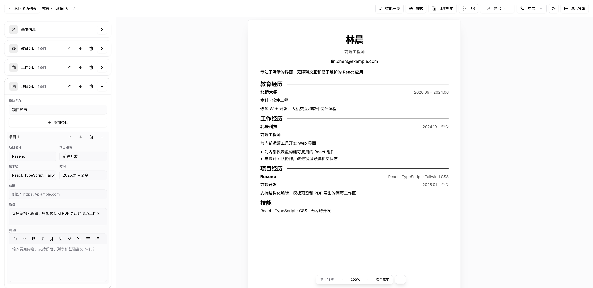
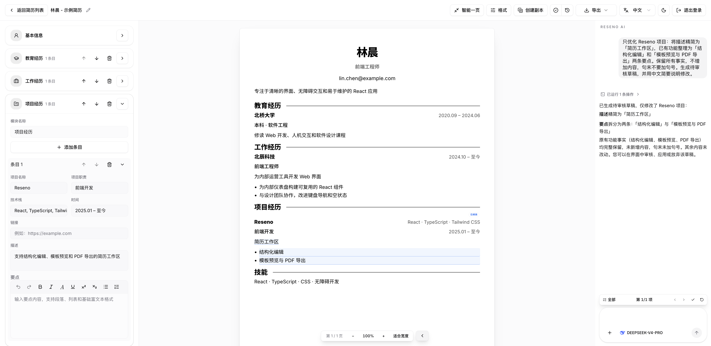

#  Reseno

[English](README.md) | 简体中文

[](backend/pyproject.toml)
[](frontend/package.json)
[](frontend/package.json)
[](frontend/package.json)
[](https://github.com/J0EY0/Reseno/actions/workflows/frontend-quality.yml)
[](LICENSE)

Reseno 是一个自托管的简历工作区，AI 只提出修改建议，从不直接改写你的简历。




## 功能

- 结构化简历编辑器，支持富文本、章节排序、头像裁剪和自定义联系方式
- 六款内置模板，可自建模板并调整布局、字体、颜色和装饰图片
- 实时 A4 预览，支持分页、模板试用和一页适配
- 自动保存、手动保存检查点、版本历史和回收站
- 导入简历和模板 JSON，在浏览器内解析 PDF；导出 JSON、PDF、PNG 或多页 ZIP
- AI Agent 支持附件、公开网页搜索、结构化修改草稿和逐项审核，可在网络中断后重新连接
- 中英文界面，简历语言与界面语言独立；支持浅色、深色和跟随系统主题
- 密码登录，可通过自己的私有 GitHub App 启用 GitHub 登录

### Agent 修改审核

查看 Agent 的修改建议，自行决定应用哪些修改。



## 快速开始

### Docker

安装并启动 [Docker](https://docs.docker.com/get-started/get-docker/)，然后直接拉取并运行已发布的镜像。
镜像包含应用所需依赖，支持 Linux AMD64 和 ARM64，无需克隆源码或在宿主机安装 Python、Node.js。

```bash
docker pull ghcr.io/j0ey0/reseno:latest
docker run -d --name reseno --init --restart unless-stopped \
  -p 127.0.0.1:8000:8000 \
  --mount type=volume,source=reseno-data,target=/data \
  --shm-size=256m \
  ghcr.io/j0ey0/reseno:latest
```

镜像在端口 8000 同时提供生产前端和 API，并内置 Playwright Chromium，用于导出和动态网页访问。
等 `docker ps` 中的 `reseno` 容器状态显示为 `healthy` 后，创建管理员账号：

```bash
docker exec -it reseno python -m app.setup_owner
```

按提示输入用户名和密码，密码输入不会显示。打开 `http://localhost:8000` 登录。系统没有默认账号密码。
首次创建管理员只接受回环地址请求，因此 Docker 部署需在容器内运行上述命令。

按上述默认配置首次启动时，会自动生成所需密钥并写入 `/data/.env`，无需手动准备 env 文件。
`reseno-data` 卷保存数据库、文件、设置和生成的密钥。更换容器时保留该卷，每个工作区使用独立的数据卷。
迁移数据前请阅读[密钥与备份](#密钥与备份)。

### 从源码运行

需要 Python 3.12+（CI 使用 3.13）、[uv](https://docs.astral.sh/uv/)、Node.js 24 和 pnpm 11.9.0。
打开两个终端，分别从仓库根目录开始执行。

在第一个终端中安装依赖并启动后端：

```bash
cd backend
uv sync --locked --no-dev
uv run --locked --no-dev playwright install --only-shell chromium
uv run --locked --no-dev uvicorn app.main:create_app --factory --reload
```

Linux 上请将上述浏览器安装命令替换为 `uv run --locked --no-dev playwright install --with-deps --only-shell chromium`，同时安装系统依赖。
无需单独安装 Google Chrome。

在第二个终端中安装依赖并启动前端：

```bash
cd frontend
pnpm install --frozen-lockfile
pnpm dev
```

打开 `http://127.0.0.1:5173`，在初始化页面创建管理员账号。Vite 会将 `/api` 代理到后端 `http://127.0.0.1:8000`。

使用 AI Agent 前，请在模型页面添加模型配置。可以连接云端提供商、本地模型服务或自定义 API。

## 配置

### 源码运行默认值

如需调整源码运行的默认配置，请在首次启动前将 [backend/.env.example](backend/.env.example) 复制为 `backend/.env`。
在进程环境中设置 `APP_ENV_FILE` 可指定其他配置文件。进程环境变量优先于文件中的值；但密钥环境变量为空时，会保留文件中已有的密钥。

| 变量                             | 源码运行默认值                                | 用途                               |
| -------------------------------- | --------------------------------------------- | ---------------------------------- |
| `APP_DATA_DIR`                   | `~/.reseno`                                   | 运行时数据的默认目录               |
| `APP_DB_PATH`                    | `APP_DATA_DIR` 内的 `app.db`                  | 简历、模板和 Agent 数据库          |
| `APP_STORAGE_DIR`                | `APP_DATA_DIR` 内的 `storage`                 | 版本文件、附件和导出文件           |
| `APP_USER_SETTINGS_PATH`         | `APP_DATA_DIR` 内的 `user_settings.json`      | 工作区偏好设置                     |
| `APP_ENV_FILE`                   | `backend/.env`                                | 配置与生成的密钥                   |
| `RESENO_MASTER_KEY`              | 首次启动时生成                                | 加密已保存的 API 密钥和 OAuth 密钥 |
| `RESENO_JWT_SECRET`              | 首次启动时生成                                | 签名登录会话                       |
| `FRONTEND_RENDER_BASE_URL`       | `http://127.0.0.1:5173`                       | Chromium 导出时加载的前端源地址    |
| `FRONTEND_DIST_DIR`              | 未设置                                        | 由后端托管的前端构建目录           |
| `BACKEND_CORS_ORIGINS`           | `http://127.0.0.1:5173,http://localhost:5173` | 前端独立托管时允许访问的源地址     |
| `PDF_RENDER_TIMEOUT_MS`          | `30000`                                       | 导出渲染超时时间，单位为毫秒       |
| `PLAYWRIGHT_CHROMIUM_EXECUTABLE` | 未设置                                        | 可选的外部 Chromium 可执行文件     |

路径覆盖项未设置或为空时，使用 `APP_DATA_DIR` 内的对应路径。身份验证数据单独保存在 `APP_DATA_DIR/auth.db`。

### Docker 配置

镜像设置了以下环境变量：

| 变量                       | Docker 值               |
| -------------------------- | ----------------------- |
| `APP_DATA_DIR`             | `/data`                 |
| `APP_ENV_FILE`             | `/data/.env`            |
| `FRONTEND_DIST_DIR`        | `/app/frontend/dist`    |
| `FRONTEND_RENDER_BASE_URL` | `http://127.0.0.1:8000` |
| `BACKEND_CORS_ORIGINS`     | 空值；前端与 API 同源   |

源码目录中的 `backend/.env` 不会打包进镜像。使用 `docker run -e` 覆盖配置，参数需放在镜像名称之前，例如 `-e PDF_RENDER_TIMEOUT_MS=60000`。
镜像环境变量优先于 `/data/.env` 中的值。

修改 `-p` 中的宿主机端口即可使用其他本地端口。更改公开主机名或端口，无需修改容器内部的渲染地址。
容器以 UID/GID 10001 运行；已有的绑定挂载目录必须允许该用户写入。

### 密钥与备份

新工作区缺少密钥时，会生成一次并写入 env 文件，权限仅允许文件所有者访问。通过环境变量或文件提供完整的密钥对时，无需写入配置。
已有数据库缺少密钥时，必须恢复原密钥；系统不会静默替换它们。

备份或恢复前先停止后端。请同时保留数据目录、自定义的数据库、存储和用户设置路径，以及 env 文件或外部管理的密钥。
Docker 默认配置下，先停止容器，再完整备份 `reseno-data` 卷，包括 `/data/.env`。

如果自定义了容器的配置路径并允许自动生成密钥，请挂载可写的配置目录，以便后端原子替换 env 文件；仅绑定挂载一个空文件无法满足此要求。
也可以通过环境变量或预先填写的配置文件提供两个固定密钥，并将它们与数据一起备份。

## 部署说明

- 每个工作区运行一个 worker 和一个实例副本。Agent 执行与 SSE 回放保存在进程中。后端会对业务数据库、身份验证目录和存储目录持有独占锁，拒绝共享其中任一位置的其他实例。持久化存储必须支持文件锁。
- 远程访问需使用 HTTPS 反向代理，转发包括 `/api` 在内的整个站点，并关闭 SSE 响应缓冲。将 Reseno 部署在域名根路径，并在远程登录前于本地完成管理员初始化。
- 从源码部署时，在 `frontend` 中运行 `pnpm build`，将 `FRONTEND_DIST_DIR` 设置为 `frontend/dist` 的绝对路径，将 `FRONTEND_RENDER_BASE_URL` 设置为 Chromium 可访问的后端源地址。启动后端时去掉 `--reload`。
- 前端独立托管时，将 `FRONTEND_RENDER_BASE_URL` 指向该前端，在同一源地址下代理 `/api`，并支持直接访问 `/pdf-export` 等 SPA 路由。
- 升级时会校验数据库结构，拒绝不兼容的数据，不会迁移或重建数据库。升级前先备份，并使用支持现有数据库结构的版本。

### GitHub 登录

先使用用户名和密码创建管理员账号，再在账号设置中选择**绑定 GitHub**。
Reseno 通过 GitHub App Manifest 流程创建归你所有的私有 GitHub App，并配置回调地址。无需将 OAuth 凭据复制到 `.env`。

配置时使用实例平时访问的浏览器地址，并保持主机名和端口稳定。远程部署要求 HTTPS；本地 HTTP 支持 `localhost` 和回环 IP 地址。
只有绑定的 GitHub 身份可以登录管理员账号。密码登录始终可用，也可在账号设置中解除绑定。
如果应用创建成功但取消了授权，返回设置并选择**绑定 GitHub**即可继续。

该应用不请求访问仓库内容或电子邮箱。客户端密钥使用 `RESENO_MASTER_KEY` 加密后存入 `auth.db`；GitHub 访问令牌和刷新令牌仅用于身份验证，不会持久保存。
本地 JWT 不会包含在回调 URL 中。

## 开发

运行检查前，先在 `backend` 中执行 `uv sync --locked --all-groups`，安装开发依赖。

在表中指定的目录运行各条命令。工具版本由 `frontend/.node-version`、`frontend/package.json`、`backend/.python-version` 声明，依赖以锁文件为准；CI 入口见[质量检查工作流](.github/workflows/frontend-quality.yml)。

| 目录       | 任务                                         | 命令                                                             |
| ---------- | -------------------------------------------- | ---------------------------------------------------------------- |
| `frontend` | 格式、源码预算、lint、类型、行为和包体积检查 | `pnpm check:frontend`                                            |
| `frontend` | 架构检查                                     | `pnpm test:architecture`                                         |
| `backend`  | lint 与类型检查                              | `uv run --locked ruff check . && uv run --locked mypy app`       |
| `backend`  | 默认后端测试集                               | `uv run --locked pytest -q`                                      |
| `frontend` | 浏览器冒烟测试                               | `pnpm test:workspace-network:smoke`                              |
| `frontend` | 本机运行完整 CI 浏览器检查                     | `pnpm test:browser:ci`                                            |
| `frontend` | 在共用 Linux 镜像中运行完整 CI 浏览器检查        | `pnpm test:browser:linux`                                         |
| `frontend` | 重新生成契约与模板预设                       | `pnpm generate:agent-contract && pnpm generate:template-presets` |

本机浏览器测试前，在 `backend` 中运行 `uv run --locked playwright install chromium`（Linux 上添加 `--with-deps`）。
`test:browser:ci` 会构建前端，并依次运行生产托管、生产 chunk 恢复、双 worker 的 dev 模式冒烟和 PDF ATS 测试。
CI 使用 `test:browser:linux` 对应的 Docker 脚本和相同测试入口。本地运行此命令需要 Docker；依赖和浏览器在镜像内安装，不挂载本机数据库、凭据或依赖目录。
两种入口均在 `backend/test-results/` 下按次保存测试结果、失败截图、trace 和服务日志；任一阶段失败即停止，不自动重试。

Linux 镜像固定操作系统、运行时和浏览器版本。Apple Silicon 本机默认运行 Linux ARM64，GitHub 浏览器任务运行 AMD64；
需要复现同一架构时可设置 `DOCKER_DEFAULT_PLATFORM=linux/amd64`，但模拟执行会有额外开销。
macOS 本机的 PDF 检查在安装 Swift 时还会覆盖 PDFKit。

`check:frontend`、定向测试和 `test:workspace-network:smoke` 只代表各自范围。
后端 pytest 未设置 `RUN_BROWSER_E2E=1` 时会跳过浏览器测试，跳过不算通过。
功能分支 push 的绿色结果也不包含浏览器任务；Pull request、`main` 和 tag 才执行完整浏览器检查。

### 本地构建镜像（可选）

如需从自己的源码构建镜像，在本地仓库根目录运行：

```bash
DOCKER_BUILDKIT=1 docker build --pull -t reseno:local .
```

将 [Docker 启动命令](#docker) 中的 `ghcr.io/j0ey0/reseno:latest` 替换为 `reseno:local` 即可。
管理员初始化和数据保存方式相同。

### 版本发布与容器镜像

后端、前端和浏览器检查全部通过后，质量检查工作流会将 Linux AMD64 和 ARM64 镜像发布到 `ghcr.io/<owner>/<repository>`；镜像路径使用小写的 GitHub 仓库名称。

| 事件                                 | 发布的镜像标签                             |
| ------------------------------------ | ------------------------------------------ |
| Pull request 或推送到其他分支        | 无                                         |
| 推送到 `main`，包括合并 Pull request | `main`、`sha-<完整 commit SHA>`            |
| 推送 `v0.1.0` 这样的发布 tag         | `0.1.0`、`latest`、`sha-<完整 commit SHA>` |

仅修改根目录 `README.md`、`README_ZH.md` 和 `docs/` 下文件的 push 或 Pull request 会跳过后端、前端及浏览器检查，也不发布镜像。
其他 Markdown 文件（包括 Agent 提示词）的变更仍触发检查。发布 tag 始终执行完整质量检查。

仅修改内置模型资料快照（可同时修改上述文档路径）时，只运行模型资料、思考模式和上下文专项测试。
这类更新跳过完整后端、前端、浏览器和容器检查，不发布镜像；混合应用代码变更和发布 tag 仍执行相应的完整检查。

发布 tag 必须采用 `vMAJOR.MINOR.PATCH` 格式，且指向已合入 `main` 的提交。预发布 tag 不会发布镜像。
`latest` 指向最近一次发布的正式版本，`main` 指向最近一次构建成功的主线版本。需要固定版本的部署应使用版本标签或镜像 digest。

模型资料维护独立于发版。需要刷新内置快照时，打开 **Actions → Update model metadata → Run workflow**，选择 `main` 并运行。
只有模型资料发生实质变化才会创建或更新 Pull request，抓取时间变化不会产生提交。
Pull request 会列出新增、删除的模型，以及上下文限制、能力等字段的具体变化。
待合并的更新没有新变化时保留原提交；若更新分支包含人工修改，先审查并合并或关闭该 Pull request，再重新刷新。
快照更新不会创建 tag 或 Release。
若 GitHub 提示机器人 Pull request 的工作流需要审批，在该 Pull request 点击 **Approve workflows to run** 即可启动专项检查。

将发布内容合入 `main` 后，确认准备打 tag 的具体提交已通过 **Quality** 检查。刷新模型资料不再是发版的必经步骤。

在仓库根目录创建并推送一个尚未使用的版本 tag。将 `VERIFIED_COMMIT_SHA` 替换为该提交的完整 SHA；例如首次发布 `v0.1.0`：

```bash
git fetch origin main
git tag -a v0.1.0 VERIFIED_COMMIT_SHA -m "Release v0.1.0"
git push origin v0.1.0
```

镜像构建使用该提交中已保存的快照。部署后的实例继续在运行时刷新模型资料。

工作流使用自身的 `GITHUB_TOKEN` 发布，无需配置 Docker Hub 凭据。首次发布后，将 GHCR 包的可见性设为公开，允许匿名拉取。
如需禁止直接推送到 `main`，请设置分支保护，要求通过 Pull request 合并且质量检查通过。

## 文档

- [项目概览](docs/PROJECT_CONTEXT_ZH.md)：产品范围、架构、数据契约、保存语义与运行时约束
- [API 参考](docs/API_ZH.md)：HTTP 路由、身份验证、响应格式、Agent SSE 与草稿审核

## 致谢

Reseno 前端使用 React、Vite、Tailwind CSS、shadcn/ui、TipTap、Streamdown、pdf.js、Lucide 和 Lobe Icons；后端使用 FastAPI、SQLite 和 Playwright。

- **Agent 设计：**感谢 [pi](https://github.com/earendil-works/pi) 在 Agent 循环与工具执行设计上提供的启发。
- **Agent 界面：**使用并适配了 [Vercel AI Elements](https://github.com/vercel/ai-elements) 的组件，采用 [Apache 2.0 许可证](frontend/public/licenses/ai-elements.txt)。
- **字体：**[Inter](https://rsms.me/inter/)、[IBM Plex Sans 和 Mono](https://github.com/IBM/plex)、[Noto Sans SC 和 Serif SC](https://fonts.google.com/noto) 使用 [SIL Open Font License 1.1](frontend/public/fonts/OFL.txt)。随项目分发的 Latin Modern 字体使用 [GUST Font License](frontend/public/fonts/latin-modern/GUST-FONT-LICENSE.txt)，另见[分发说明](frontend/public/fonts/latin-modern/NOTICE.txt)和 [LPPL 全文](frontend/public/fonts/latin-modern/LPPL-1.3c.txt)。
- **模型元数据：**来源于 [models.dev](https://github.com/anomalyco/models.dev) 和 [LiteLLM](https://github.com/BerriAI/litellm)，源项目许可证全文见 [model_metadata_licenses.txt](backend/app/services/model_metadata_licenses.txt)。
- **网页搜索：**本地 Agent 搜索使用 DuckDuckGo 的公开 HTML 端点。Reseno 与 DuckDuckGo 没有关联关系。

## 许可证

MIT，详见 [LICENSE](LICENSE)。第三方组件保留各自的许可证。
